# Swiss Cobalt

**Branch:** `style/swiss-cobalt` · App: `andreas-technology-v3`

## Round 4: back to Cobalt Block, with Swiss tweaks

Round 3 merged Cobalt Block and Swiss Editorial but leaned Swiss: mostly paper, with blue only as occasional fields. Andreas preferred the earlier Cobalt Block ("I liked the previous a bit better") and loved the Swiss Cobalt contact panel. Round 4 is therefore **Cobalt Block again**, with its split-screen colour blocking, the blue block that changes side panel to panel, the name across the seam and the big fitted headlines. A few Swiss details are layered on top where they genuinely help. The contact panel is carried over **unchanged**.

Both branches were screenshotted side by side (1440×900 and 390×844, light and dark) before any code changed. The table records what each panel takes from where.

### Per-panel decisions

| Panel | From Cobalt Block | From Swiss Cobalt (round 3) | New tweak |
| --- | --- | --- | --- |
| **Nav** | Flat bar, active section as a sliding cobalt block (`layoutId`), square Light/Dark and GR/EN buttons, cobalt mobile sheet | Numbered index (`01 About … 05 Contact`), Home via the logo, meta type | **Memoji logo** on a cobalt square instead of `AF`. Removed the hover glyph-scramble on labels and the `01 / 06` counter (the numbered items already say where you are). The mobile sheet lists mixed-case heavy titles with `00–05` |
| **Hero** | 40/60 split, `ANDREAS` white on cobalt and `FRAGKIADAKIS` cobalt on paper at one fitted size, `Automate. / Secure. / Scale.` crossfade, role line, square socials, CTAs, live clock with the one red dot | **Meta-row header**: a strong hairline carrying `(00) Home` on the block and a 3-column row (Based in / Local time / Current focus) on paper | Both halves' meta rows sit at the same height as every other panel's header. CTAs use the contact panel's button cut |
| **About** | Paper 56 / cobalt 44. Giant fitted `550+`, the three minor counters, the spec sheet, credential strip, 2×2 skill blocks, both marquees | `(01) About` meta row + heavy mixed-case title, localised spec-sheet labels (`Ρόλος`, `Στόλος` …) | Content is bottom-aligned so it ends on the same line as the spec sheet opposite. On short desktops (≤800px tall) the second paragraph and second marquee drop out, so nothing is clipped |
| **Services** | Paper 30 / checkerboard 70, six inverting blocks, dialogs with cobalt header and tool tiles | `(02) What I do` meta row + heavy title | CTA line and "Let's Talk" grouped at the foot of the column |
| **Experience** | Cobalt 46 (left) / paper 54. Huge rolling start year, full period, tasks, white **Verify credential** button. Professional / Education tabs. Mobile accordion | **Index table**: column heads (No. / Role — Company / Year) on a strong rule, tabular row numbers, condensed year spans (`2024 – 2026`, `2026 – Now`), cobalt bar for the active row with a bleed | The CB list's big year numerals were dropped from the rows; the giant year lives only in the block, so the table reads calmly |
| **Projects** | Paper 56 / cobalt 44 with the tilted screenshot stack, giant project number, name and role. Case-study dialog | **Index table**: No. / Title / Tags (≥1280px) / Year / Links, active row as a cobalt bar, `Live ↗` `Code ↗` text links, GitHub link in the meta row | Mobile rows keep CB's thumbnails. The active bar is desktop-only, because it is tied to the stack |
| **Contact** | — | **Kept exactly** (full cobalt field, heavy "Get in touch", fitted email with Copy, facts row, Send message / Download resume, copyright, Back to top) | None needed: its `(05)` index already matches the new nav numbering, and the page tokens it uses (`.field`, `.meta`, `.display-heavy`, `rule-t`) are kept verbatim |
| **Intro** | Cobalt title card with the typewriter lines and "Enter System" | — | Memoji on a paper square in the corner. Heavy lines use the title cut |
| **Dialogs** | Square wipe-open panel with the offset cobalt shadow, white close square, cobalt headers | — | Titles in heavy mixed case, meta labels |
| **OG image** | 40/60 split with the name across the seam | Meta rows on hairlines | Memoji embedded as a data URL on a paper square |

### Global Swiss tweaks

- **One family.** Inter Tight now carries everything: body, meta labels, buttons and the heavy display cuts. Inter and JetBrains Mono are gone (two fewer font downloads). The mono eyebrows became Swiss `.meta` labels (11px, uppercase, +0.06em), which are the same labels the contact panel already used.
- **Title hierarchy.** Section titles are heavy mixed case (`.display-heavy`, 850), the same cut as "Get in touch". Uppercase 900 (`.font-display`) is reserved for the giant words fitted to a block: the name across the seam, `550+`, the year and the project number.
- **Meta rows.** Every panel and every block opens with the same strong hairline and `(NN) Label ··· note` row at `pt-5` below the nav, so the headers line up as the track scrolls.
- **One margin.** `--gutter: 2.5rem` is used on every panel and every block. Cobalt Block's margins used to vary between 40, 48, 56 and 64px.
- **Buttons.** Still square, and still wiping a second colour up on hover. They now use the contact panel's cut: 14px semibold, sentence case, arrow on the right, 1px outlines.
- **Paper stays white** (`#FFFFFF`, Cobalt Block), not round 3's warm `#F2F1EC`, because it is crisper against ultramarine.
- **No pointer-following anything.** `CustomCursor` and `ScrambleText` are not used. The scroll-linked "breathing" scale on the track is also off.

### Logo

Every `AF` monogram is gone: the nav square, round 3's hero band, and the OG image. The logo is now the technologist memoji (`public/favicons/android-chrome-512x512.png`, the favicon image), rendered by `src/components/ui/Memoji.tsx` with `next/image` and alt "Andreas Fragkiadakis":

- **Nav (paper or ink):** a 36px cobalt square, so the mark is itself a small colour block. The image is scaled 1.15× from the bottom edge so the face fills the square without cropping the hair.
- **Mobile menu sheet and intro card (on cobalt):** a white square, which keeps the memoji crisp on ultramarine.
- **OG image:** a 112px white square on the cobalt half. The PNG is read with `fs` at build time and embedded as a `data:` URL, so the card needs no fetch.

## Tokens (`src/app/globals.css`)

| Token | Light | Dark | Use |
| --- | --- | --- | --- |
| `--background` | `#FFFFFF` paper | `#0A0A0A` ink | page |
| `--foreground` | `#0A0A0A` | `#FFFFFF` | text, strong rules |
| `--cobalt` / `--block` | `#2323FF` | `#2323FF` | every field; the same in both themes |
| `--accent` / `--accent-ink` | cobalt | `#8C93FF` | cobalt as text or a thin mark (indices, the role-line rule) |
| `--display` | cobalt | white | the surname on the page background |
| `--muted` | ink 70% | paper 70% | secondary text, meta labels |
| `--line` / `--rule` | ink 16% | paper 16% | hairlines |
| `--rule-strong` | ink 90% | paper 90% | meta-row rules, table heads |
| `--signal` | `#FF3B30` | `#FF3B30` | the live-clock dot only (non-text) |
| `--gutter` | 2.5rem | 2.5rem | panel and block margins |

`.surface-block` (the split panels) and `.field` (Contact) are one rule. Each redefines the page tokens, so anything placed on cobalt (meta labels, rules, links, buttons, focus rings) turns white-on-blue without extra classes. An active, hovered or focused `.index-row` does the same.

### Contrast (WCAG 2.x, computed)

| Text / mark | On | Ratio | Result |
| --- | --- | --- | --- |
| white | cobalt `#2323FF` | **7.62 : 1** | AA + AAA |
| cobalt | paper `#FFFFFF` | **7.62 : 1** | AA + AAA |
| tint `#8C93FF` | ink `#0A0A0A` | **7.3 : 1** | AA + AAA |
| white 82% (`#D7D7FF`) | cobalt | 5.46 : 1 | AA (lowest small text on a field) |
| muted (ink 70%) | paper | 7.6 : 1 | AA |
| muted (paper 70%) | ink | 9.8 : 1 | AA |

Cobalt on ink is only 2.6 : 1, so on the dark theme cobalt is a field colour only, and text accents switch to the tint.

## Motion

- **Block wipes** (`src/utils/motion.ts`, `Panel`, `Field`). A clip-path inset uncovers each cobalt block from its outer edge as the panel enters. The contact field wipes up from the bottom.
- **Line rise.** Giant words rise out of their masks after the block lands. Section titles rise word by word and are keyed by language, so EN/GR replays them.
- **Word crossfade.** `Automate. / Secure. / Scale.` crossfades letter by letter, and the role line swaps whole lines.
- **Rows and cells.** Index rows become a cobalt bar (fill bleeds 10px, nothing shifts, title nudges 6px). Service blocks and skill cells wipe the opposite colour up. Hover inversion only applies to real pointers (`@media (hover: hover)`), so a tap never leaves a row stuck in cobalt.
- **Nothing follows the cursor.**
- **Reduced motion.** `MotionConfig reducedMotion="user"`, `Panel` renders its final state, `[data-field-wipe]` drops its clip in CSS, and word cycles hold their first word. Verified: 0 blocks left clipped on any panel under `prefers-reduced-motion`.

## Accessibility

- The focus ring is `--focus`: cobalt on paper, white on ink and on every cobalt surface. A focused index row becomes the cobalt bar with its ring drawn inside the fill.
- `h1` is sr-only with the name and title, and the split name is `aria-hidden`. Word cycles expose their full list once. The Experience block is an `aria-live` region, and its rows are `aria-controls` / `aria-expanded` for the mobile accordion.
- Dialogs trap focus, close on Escape and return focus to the control that opened them.

## Trade-offs and open questions

- **Mixed-case section titles.** Cobalt Block set section titles in uppercase 900. They are now heavy mixed case, to match the loved "Get in touch" and to keep Greek accents (`Σχετικά`, `Καριέρα`) that uppercase Greek drops. The name across the seam stays uppercase. If he misses the all-caps punch, this is a one-class switch.
- **Whitespace under titles.** As on the contact panel, paper-side content is bottom-aligned, which leaves a deliberate band under each title.
- **Truncation.** Long project titles and some long role names in the Experience table are truncated on desktop. The full text is in the block, the dialog and the aria label.
- **OG font.** `next/og` renders with its default font, because Satori cannot read the woff2 files from `next/font`.
- **Content left as is:** `t.cursor` strings remain in `content.ts` (now unused), and some historical task bullets still cite 400+ for earlier work. The Greek About paragraph now correctly says **άνω των 550 συσκευών**.

## Verification

- `npm run lint`: 0 errors (1 existing `` warning in `LogoLoop`). `npx next build`: passes, and `/opengraph-image` prerenders with the embedded memoji.
- **Panel fit** (content bottom vs panel bottom, every panel): 0px overflow at 1440×900 EN/GR, 1280×720 EN light and GR dark, and 1024×768 GR.
- **Mobile 390×844:** 0px horizontal overflow in EN dark and GR light.
- **Greek** was checked on every desktop panel, on mobile and in the mobile menu. The surname fits at the shared size, and `Επιλεγμένα έργα` wraps cleanly onto two lines.
- **Reduced motion:** no clipped blocks on any panel.
- **Console:** only the local `/_vercel/speed-insights/script.js` 404.

## Previews

### Light

| | |
| --- | --- |
|  |  |
|  |  |
|  |  |

| Mobile 1 | 2 | 3 | 4 | 5 |
| --- | --- | --- | --- | --- |
|  |  |  |  |  |

### Dark

| | |
| --- | --- |
|  |  |
|  |  |
|  |  |

| Mobile 1 | 2 | 3 | 4 | 5 |
| --- | --- | --- | --- | --- |
|  |  |  |  |  |

### States

| | |
| --- | --- |
| **Services block hover** 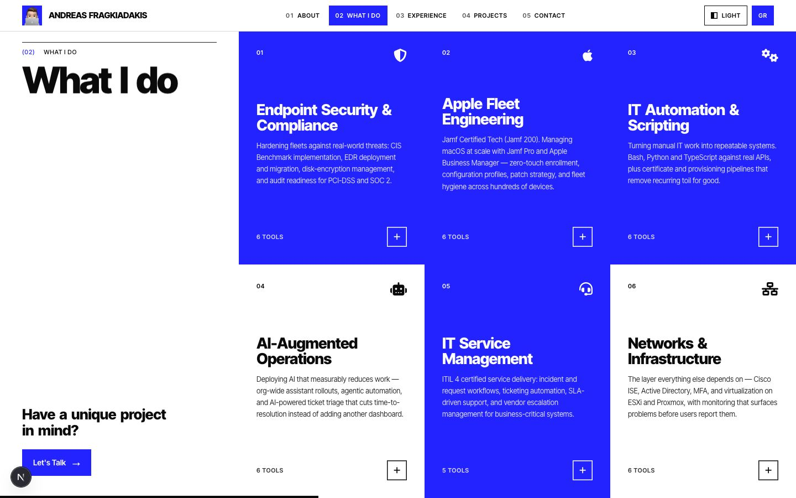 | **Projects row + stack (dark)** 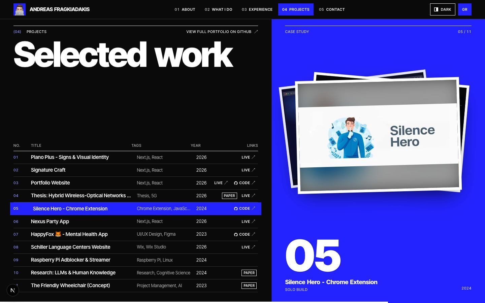 |
| **Project dialog** 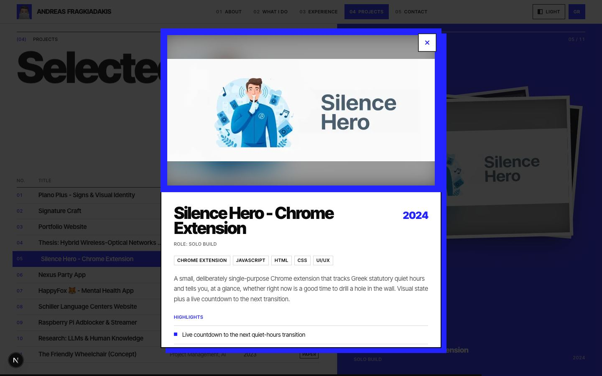 | **Education + verify (dark)** 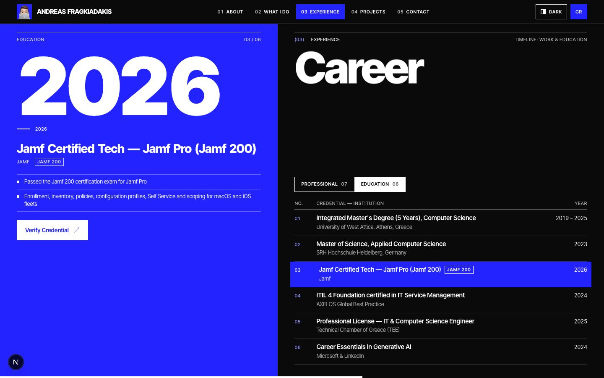 |
| **Keyboard focus** 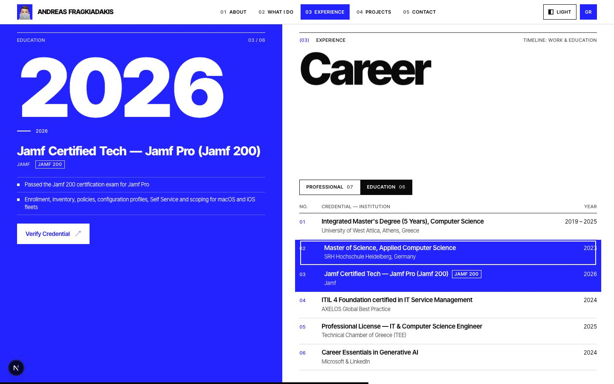 | **Intro card** 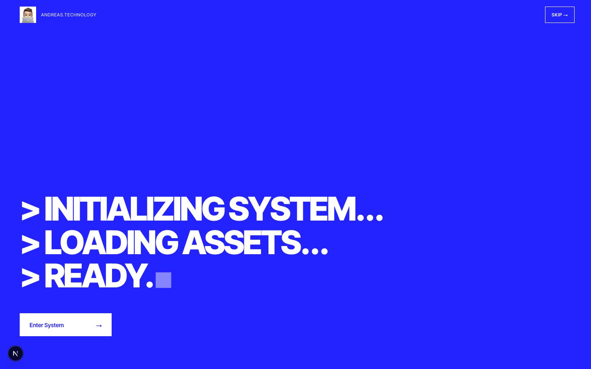 |
| **Greek hero** 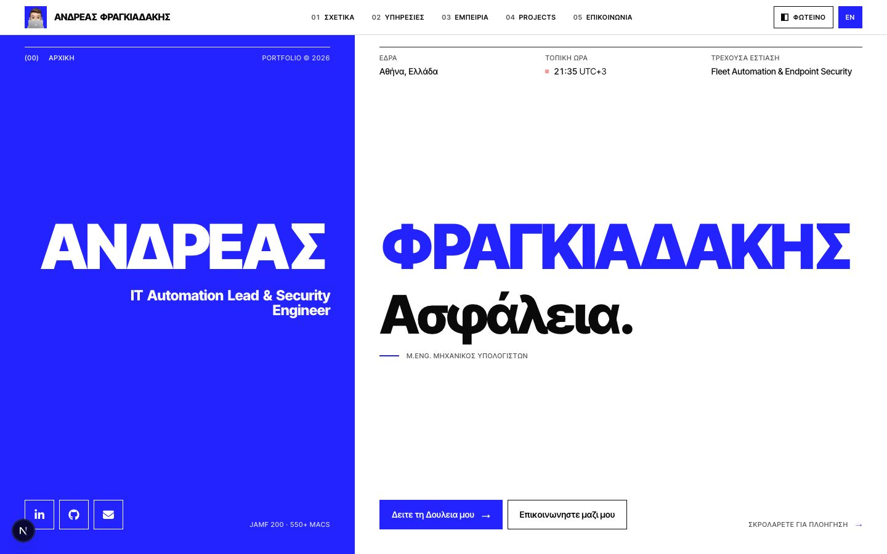 | **Greek career** 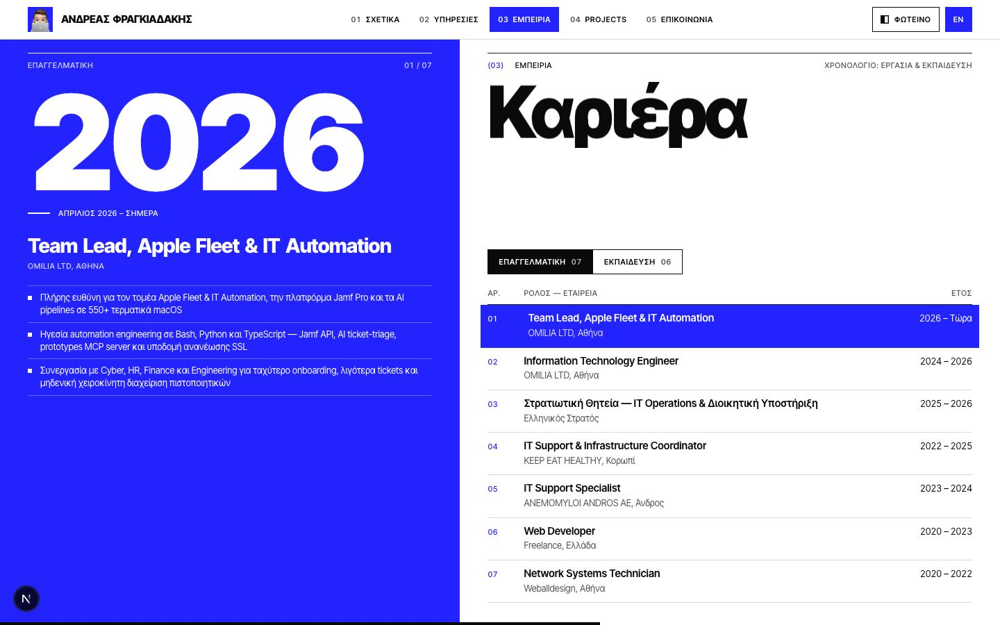 |
| **Greek projects** 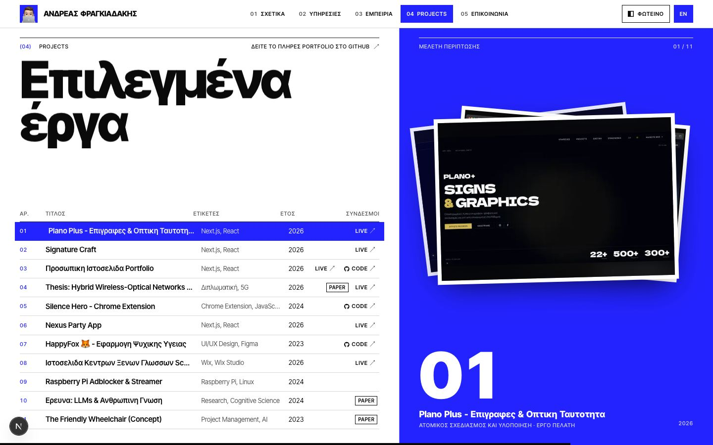 | **Greek contact** 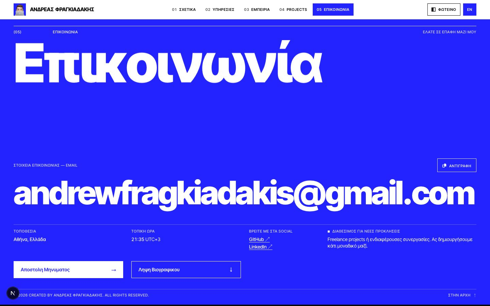 |
| **Contact close-up** 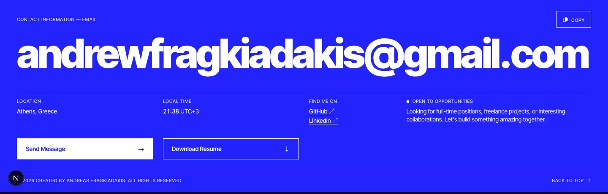 | **Contact close-up (dark)** 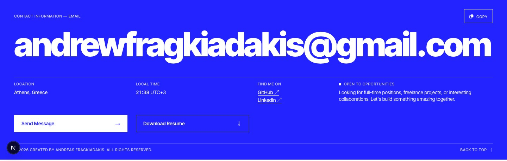 |
| **Short desktop 1280×720** 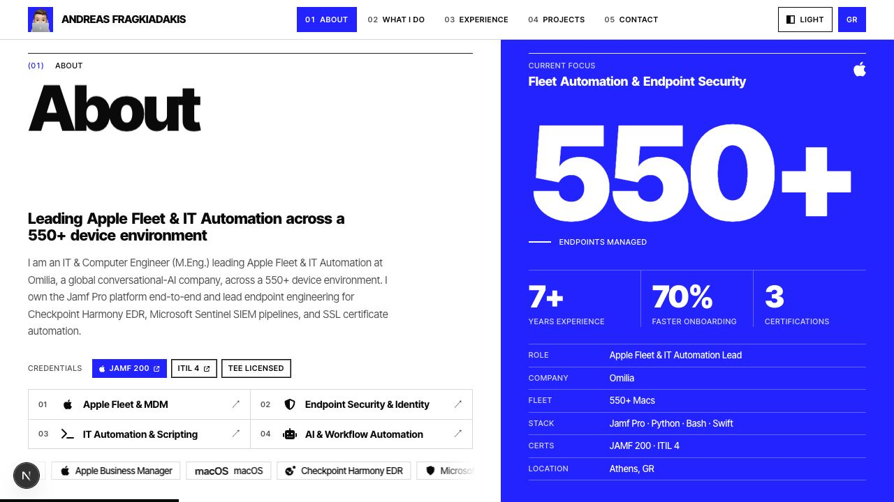 | **Greek mobile menu**  |
| **Logo (light, 3×)** 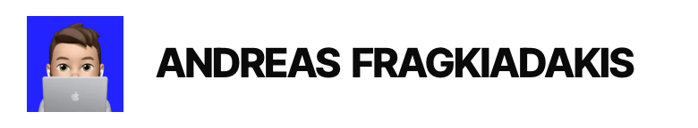 | **Logo (dark, 3×)** 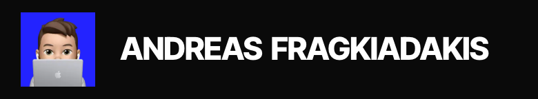 |
| **OG image**  | |
