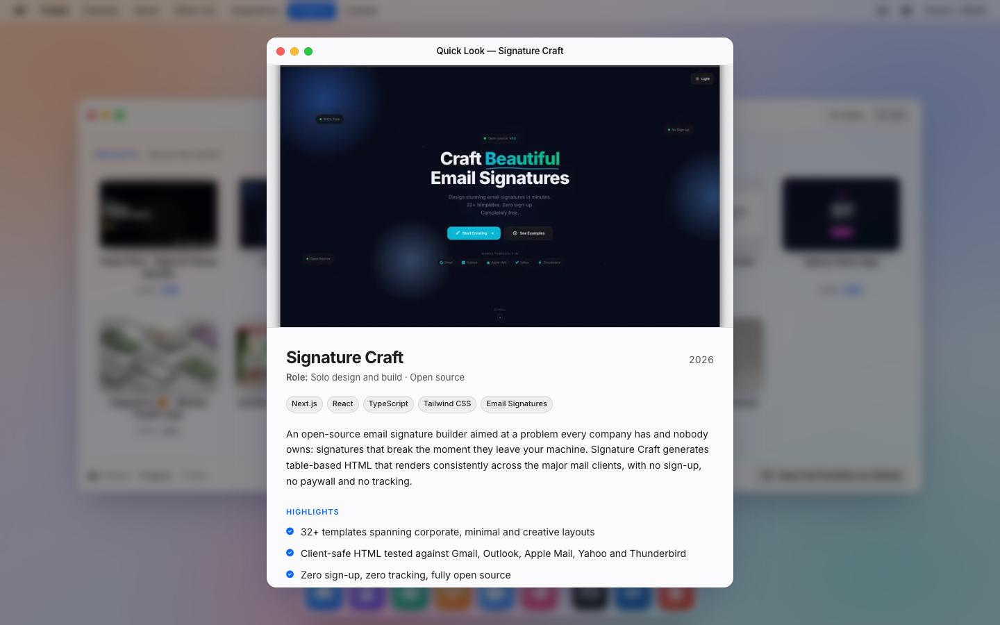
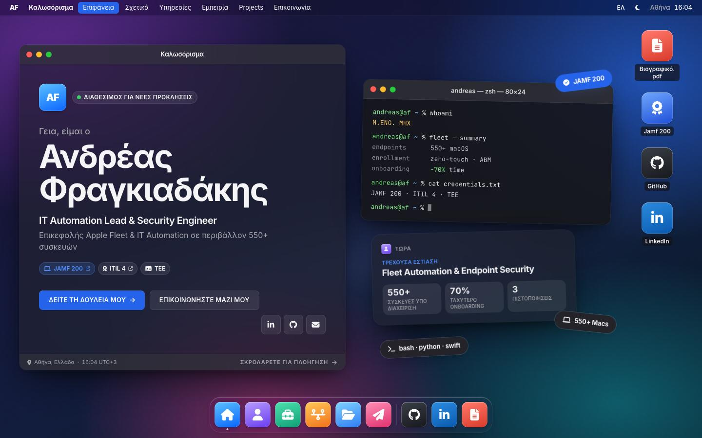

# Desktop OS

**Branch:** `style/desktop-os`

## Concept

The portfolio is a computer desktop. That suits someone who manages 550+ Macs for a living. A frosted menu bar runs across the top. Each section is an app window with traffic-light controls and a title bar. A dock at the bottom opens the windows. On desktop the wallpaper stays fixed while the windows slide past on the existing horizontal track, which feels like swiping between desktop spaces. On phones the same windows become a stack of full-width app cards, with a status bar, a four-app dock and a home-screen app grid as the menu.

The look is macOS-*inspired*, not a copy. There is no Apple logo, no Apple wordmark, and no claim to be Apple software. App tiles are original gradient squares with Font Awesome glyphs. Where the content file asks for the `fab fa-apple` glyph, the interface shows a laptop instead (`uiIcon()` in `src/data/apps.ts`). Tool logos in the toolkit marquee, such as Apple Business Manager, are left alone because they name tools, as before.

## Inspirations

| Site | What was taken |
| --- | --- |
| [Mimosa Agency](https://www.awwwards.com/sites/mimosa-agency) | The homepage as a scattered desktop collage of small OS-style widgets. This became the hero: a Welcome window, a Terminal, a "Now" widget and desktop icons, overlapping slightly on the wallpaper. |
| [Digital Meadow](https://www.awwwards.com/sites/digital-meadow-1) | The whole site framed as a developer tool, with navigation named like files. This became the Terminal widget (`whoami`, `fleet --summary`, `cat credentials.txt`), file-like icon labels (`Resume.pdf`) and the `engineer.ts` code pane in About. |
| [Tokonoma Studio](https://www.awwwards.com/sites/tokonoma-studio) | Rotated sticker pills stuck to the canvas. This became the three stickers on the hero desktop ("JAMF 200", "550+ Macs", "bash · python · swift"). They spring into place, slightly askew. |

## Tokens

### Palette

| Token | Light | Dark | Use |
| --- | --- | --- | --- |
| `--foreground` | `#1D1D1F` | `#F5F5F7` | ink |
| `--muted` | `#55555C` | `#A6A6AD` | secondary text, labels |
| `--accent-brand` | `#0A66FF` | `#4C8DFF` | system blue as a **mark**: focus ring, rails, bullets, hover rings |
| `--accent` | `#0057D9` | `#7FAEFF` | system blue as **text**: eyebrows, links, chip text |
| `--accent-fill` | `#0A66FF` | `#2563EB` | filled buttons, active menu item, sticker (white text) |
| `--window` | white @ 74% + `blur(30px) saturate(170%)` | `#222228` @ 74% + blur | window glass |
| `--window-solid` | `#FBFBFD` | `#232329` | dialogs, segmented "on" state |
| `--titlebar` / `--sidebar` | white @ 72% / `#EEF0F6` @ 72% | `#34343C` @ 60% / `#1A1A20` @ 60% | window chrome |
| `--hairline` | ink @ 10% | white @ 9% | 1px rules |
| `--menubar` / `--dock` | white @ 60% / 42% + blur | `#14141A` @ 55% / `#2C2C34` @ 42% + blur | menu bar, dock |
| Wallpaper | peach `#FFC4A3` → pink `#F7B3D2` → periwinkle `#AFC2FF` → aqua `#9FDCE3` over `#FCE3D3 → #CBE9EE` | violet `#5B2A8C` → plum `#7A2A5E` → blue `#1F4FB0` → teal `#0E5A68` over `#1B1236 → #0A1A26` | fixed layer with a soft light ribbon and fine grain; no photos |
| Terminal | always dark: `#16161B` @ 90% | same | the Terminal widget, like a real terminal profile |

The brief's system blues (`#0A66FF` and `#4C8DFF`) sit just below 4.5:1 when used as small text on frosted glass or on a tinted chip. Pure `#0A66FF` measured 4.46:1. So they are kept for marks and fills, and a slightly deeper or lighter blue carries text. Both themes are designed separately, not inverted.

**Contrast (WCAG 2.x, measured against the glass as it composites over the wallpaper):**

| Text | On | Light | Dark |
| --- | --- | --- | --- |
| ink | window glass | 15.6 : 1 | 14.4 : 1 |
| muted | window glass (warm and cool corners) | 6.8 : 1 | 6.2–6.5 : 1 |
| `--accent` text | window glass | 5.7 : 1 | 7.0 : 1 |
| `--accent` text | accent-tinted chip | 4.9 : 1 | 5.6 : 1 |
| `--accent` text | control (hover) | 4.6 : 1 | 4.5 : 1 |
| white | `--accent-fill` button | 4.8 : 1 | 5.2 : 1 |
| muted | menu bar | 6.6 : 1 | 6.7 : 1 |
| desktop icon label | label pill over wallpaper | 15.2 : 1 | 13.9 : 1 |
| terminal text / dim / green / yellow / blue | `#16161B` | 14.5 / 5.4 / 11.7 / 12.8 / 9.3 : 1 | same |
| code pane keyword / string | card | 5.5 / 6.4 : 1 | 7.2 / 7.9 : 1 |
| focus ring `--accent-brand` | glass (non-text, ≥ 3 : 1) | 4.4 : 1 | 4.9 : 1 |

### Type

- **Inter** is loaded with `next/font/google`, using subsets `latin` and `greek` and variable weight. It is exposed as `--font-inter` → `--font-sans`. UI sizes are tight: the title bar is 13px/600, body text is 13–14px, and eyebrows are 11px/600 with +0.08em tracking. Headings are solid and mixed case: the hero name is 48–72px/700 with −0.035em tracking, and window headlines are 22–28px/700. There is no outlined type anywhere.
- **JetBrains Mono** is loaded with `next/font/google`, using subsets `latin` and `greek`. It is exposed as `--font-jetbrains` → `--font-mono`. It is used for the Terminal, the `engineer.ts` pane, the boot log and the mail signature line.
- **Greek:** both families include Greek glyphs, so Greek headings render in Inter Bold, not a fallback. The Greek hero name uses a new, fully accented `os.displayName` (`Ανδρέας Φραγκιαδάκης`). Many Greek UI labels in `content.ts` are written without tonos because they were always shown in capitals. A `.caps-gr` class keeps exactly those labels uppercase **only** when `<html lang="el">`, so English labels can be in natural case while Greek never shows unaccented lowercase.

### Shape and motion

- Windows have a 14px radius, a layered soft shadow and a 0.5px hairline. App tiles are rounded squares at a 22.5% radius. Chips and stickers are pills.
- **Window open:** each window scales from 0.9 and rises 56px with a fade, from its bottom edge. That is the direction of the dock. It plays when the window scrolls into view (the hero waits for the boot screen). The ease is `EASE_OUT` over 0.7s.
- **Dock:** icons magnify by 1.18 and lift 6px on hover. A tooltip appears above, and a dot marks the front app.
- **Stickers:** they spring in with a slight rotation overshoot.
- **Reduced motion:** windows, widgets, stickers and Finder icons render in place with `initial={false}`. Dock magnify, the status-light ping and the cursor pulse sit behind `motion-safe:`. `MotionConfig reducedMotion="user"` and the global reduced-motion CSS still apply.

## Per-section changes

| Section | Before | Desktop OS |
| --- | --- | --- |
| Chrome | Top text nav with a section counter; a floating theme pill; a custom cursor; a noise overlay; a bottom progress bar | **Menu bar:** "AF" monogram, then the front app's name in bold ("Finder", "Mail", "Timeline"…), then one menu per section with the active one filled blue, then status items (EN/ΕΛ, theme toggle, "Athens 15:53" from `LocalTime`). **Dock:** six section apps (using `scrollToSection`), a divider, then GitHub, LinkedIn and Resume. The native cursor is back. |
| Boot | Typewriter "INITIALIZING SYSTEM" overlay | A boot screen: AF tile, progress bar, the same typed log in JetBrains Mono, and a white "Enter System" pill. Same copy, same skip. |
| Hero | Outlined name with a glitch-canvas cursor | A **desktop**. The Welcome window has the AF tile, an "Open to Opportunities" status, the name (solid), the role line, the tagline, credential chips (Jamf 200 → Credly, ITIL 4 → PDF, TEE) and CTAs (View My Work, Get In Touch, LinkedIn/GitHub/email). Its footer shows location, the live clock and "Scroll to navigate". A **Terminal** widget cycles the role typewriter and prints fleet facts. A **Now** widget shows current focus and three stats. There are three rotated stickers. **Desktop icons** (Resume.pdf, Jamf 200, GitHub, LinkedIn) are real links. |
| About | Outlined heading, code card, marquee | **About.app.** The sidebar has an identity card, current focus, a spec list with count-up stats, and an `engineer.ts` pane (shown only when the viewport is tall enough). The main pane has the tagline, two paragraphs, credential chips and four skill cards that open the skill dialog. The tool marquee is a two-row status strip. |
| What I Do | Spotlight cards grid | **Services — Finder.** A Favorites sidebar links to every window, with this one selected. There are six colour-tiled service cards, each opening the service dialog with its highlights and toolkit. A path bar shows "andreas › What I Do · 6 items" plus the "Have a unique project in mind? → Let's Talk" CTA. |
| Experience | Square cards carousel | **Experience — Timeline.** A timeline rail with a dot and date chip per stop. The current role is blue. Work and education cards share one scroller. A title-bar segmented control jumps between Professional and Education, next to prev/next arrows. A progress rail runs underneath. Verify Credential links are kept. |
| Projects | Image carousel with hover captions | **Projects — Finder** with an **Icons / List** segmented control. Icons view is a Finder grid with thumbnails, name, year and LIVE/OSS/PAPER tags. List view is a table with Name, Kind, Year, and every Live/Code/Report/Publication link. Clicking opens **Quick Look**, which is the project dialog. The path bar shows the item count and "View Full Portfolio on GitHub". |
| Contact | Two bordered boxes | **Contact — Mail.** It is a compose window: *To:* the address as a chip plus Copy, and *Subject:* the pre-filled subject. The body has the availability headline, the description and a mono signature, then Send Message and Download Resume. A Send button sits in the title bar. The side panel is a contact card with email, location, local time, GitHub and LinkedIn. The copyright is in the status bar. |
| Dialogs | Bordered modal with a × | A window with traffic lights. **The red light is the real close button** (a 24px target). On phones a "Close" text button is added. Focus trap, Escape and focus return are unchanged. |
| Mobile | Vertical sections, bottom tab bar, full-screen menu | A status bar (AF + clock, EN/ΕΛ, theme, app-grid button). Windows are full-width app cards with an app tile beside the title. A four-app frosted dock hides while scrolling down. The launcher is a home-screen **app grid** of all six sections, with a theme and language row. There is no horizontal page overflow at 390px. |

## Files

- New: `src/components/ui/Window.tsx` (window, `AppTile`, `TrafficLights`), `src/components/dom/Dock.tsx`, `src/components/ui/CredentialChips.tsx`, `src/data/apps.ts` (app tiles, `uiIcon`), `src/hooks/useActiveSection.ts`, `src/utils/links.ts`.
- Rewritten: `globals.css` (tokens, wallpaper, window/dock/menu-bar component classes in `@layer components`, and a class-based `dark:` variant), `Navigation.tsx` (menu bar, status bar, launcher), `MobileNav.tsx`, `HeroOverlay.tsx`, `About.tsx`, `Services.tsx`, `Experience.tsx`, `Projects.tsx`, `Contact.tsx`, `CinematicEntry.tsx`, `ThemeToggle.tsx` (now a status item), and `Modal.tsx` (now a window).
- Adjusted: `layout.tsx` (Inter and JetBrains Mono with Greek, wallpaper layer, theme-color), `HorizontalLayout.tsx` (transparent track, panel padding for the menu bar and dock, card stack on mobile), `LocalTime.tsx`, `CopyButton.tsx`, `useCardScroll.ts` (generic element type), `ScrollRail.tsx`.
- Content: `content.ts` gains an `os` block in **both languages**: window titles, menu names, dock and icon labels, view and table labels, aria strings, and the accented display name. It also gains `RESUME_URL` and `MAIL_SUBJECT` constants. No existing copy was removed.
- Removed, because nothing uses them in this style: `LetterGlitch`, `ScrambleText`, `CustomCursor`, `NoiseOverlay`, `SpotlightCard`, `SectionHeading`, `RollText`.

## Trade-offs

- **Glass costs GPU.** Every window, the menu bar and the dock use `backdrop-filter`. It is fine on modern hardware, but it is the heaviest part of this style. The wallpaper is pure CSS gradients, so there is no image to download.
- **Windows are not draggable.** They look draggable but they are not. Real dragging would fight the horizontal scroll journey and hurt keyboard and touch use. The traffic lights on section windows are decorative (`aria-hidden`). Only a dialog's red light does something: it closes the dialog.
- **Some copy stays in English in both languages.** Terminal output and app names ("Finder", "Mail", "About.app") read as software names rather than prose. Everything a visitor needs to read is translated.
- **The Experience cards share one height** so the timeline reads as a row. Short roles leave empty space at the bottom of their card.
- **Service descriptions are clamped** to four lines on the card. The full text is one click away in the dialog.
- **The `engineer.ts` pane in About hides on short desktop viewports** (below 52rem, about 832px, tall) so the About window never needs an inner scroll.
- **Fit at 1440×900 was checked by script.** No panel scrolls internally. The only clipped elements are the intended line clamps and the blurred image fill.

## Previews

Light, desktop 1440×900:

| | |
| --- | --- |
|  |  |
|  |  |
|  |  |

Dark, desktop:

| | |
| --- | --- |
|  |  |
|  |  |
|  |  |

Mobile 390×844 (light / dark):

| | | | | |
| --- | --- | --- | --- | --- |
|  |  |  |  |  |
|  |  |  |  |  |

Dialogs, views, Greek and boot:

| | |
| --- | --- |
|  |  |
|  |  |
|  |  |
|  |   |
