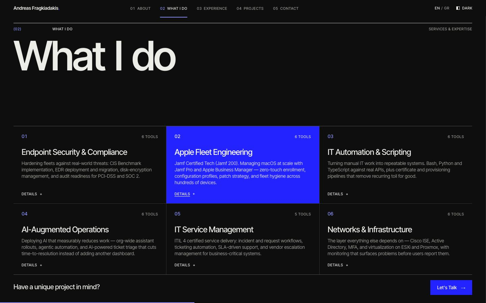
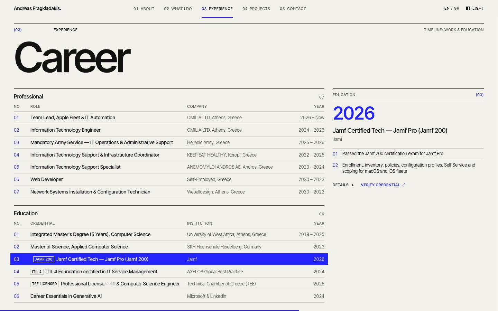
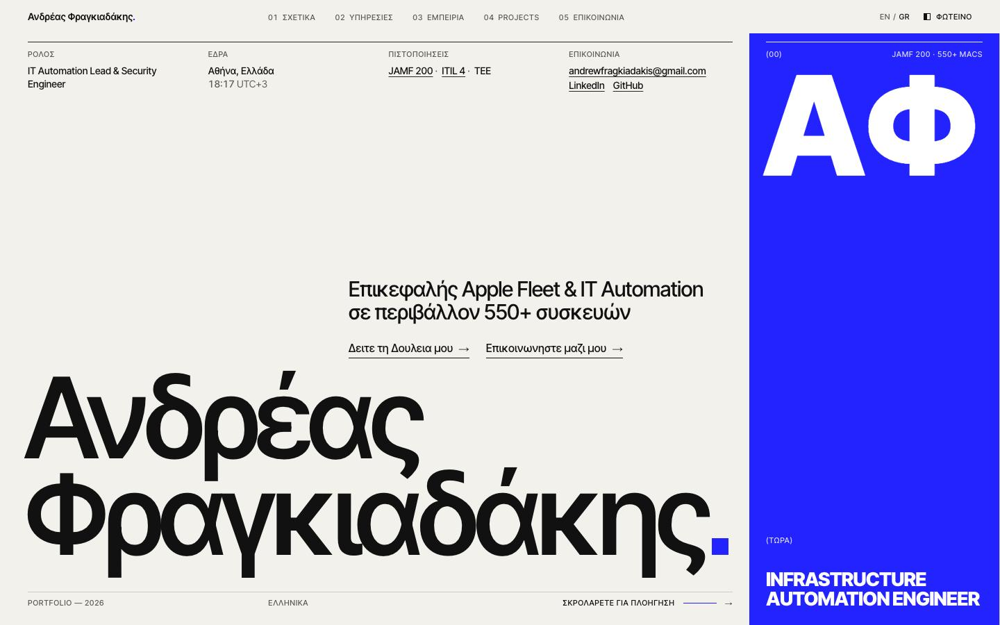
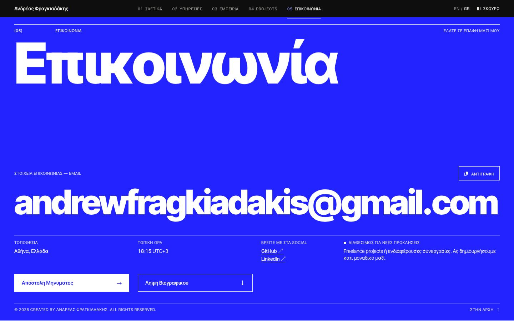
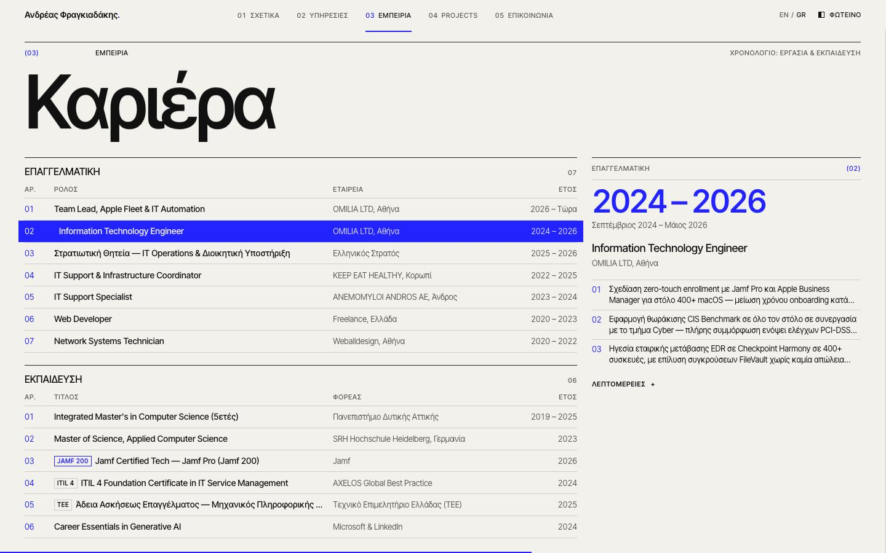
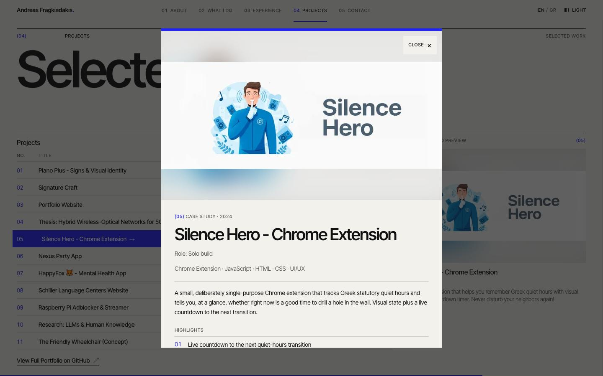
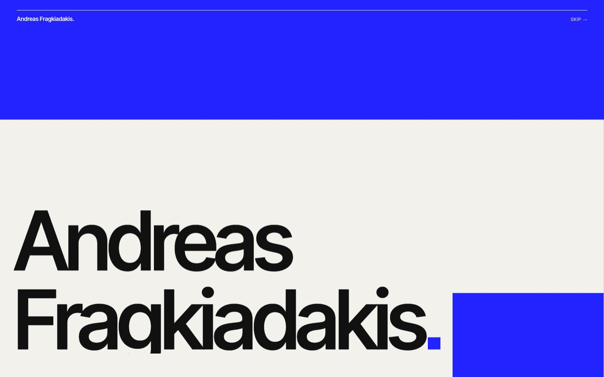
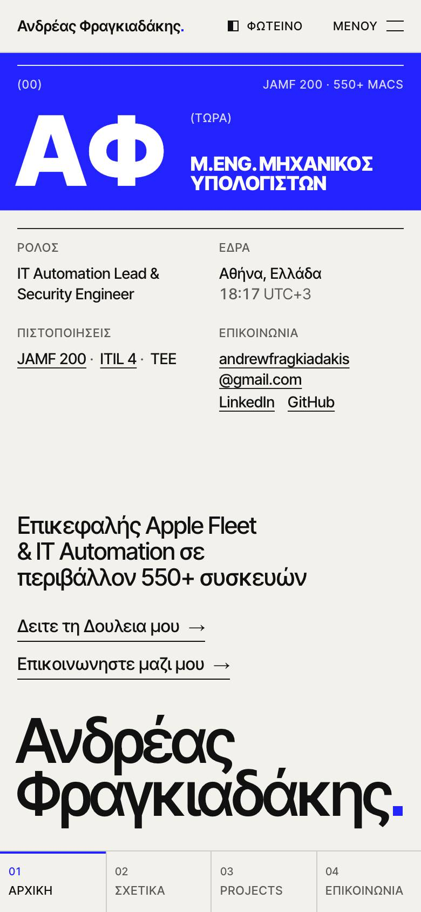

# Swiss Cobalt

**Branch:** `style/swiss-cobalt` · App: `andreas-technology-v3`

## Concept

A hybrid of the two shortlisted directions. The discipline comes from **Swiss Editorial** and the colour comes from **Cobalt Block**. The page is set as a printed index: warm paper, near-black ink, one grotesk (Inter Tight), a strict 12-column grid and 1px rules instead of cards. There is one colour, an ultramarine `#2323FF`. It is never used as a tint or a gradient. It appears only as a solid, full-bleed **field** at five key moments:

| Moment | Field |
| --- | --- |
| Hero | A vertical band on the right (25vw, full height). It holds the monogram `AF` / `ΑΦ` in 850 weight at the top and the rolling current role at the foot. |
| About | A full-bleed figures strip: the tagline plus 7+ / 550+ / 70% / 3 in heavy tabular numerals. |
| Index tables | The active row in Experience and Projects (the one feeding the preview column) is a cobalt bar. Hover and keyboard focus invert any row or service cell the same way. |
| Contact | The whole panel is one cobalt field: the heavy title, the email fitted across the full measure, and the facts and actions on white hairlines. |
| Intro | The first-visit title card is a cobalt field that wipes up to reveal the hero. |

Everything else is paper and ink. The owner asked for clean, precise, one confident accent, and no cursor-following gimmicks. The custom cursor from Swiss Editorial has been removed.

## What was taken from each branch

| From Swiss Editorial | From Cobalt Block |
| --- | --- |
| Paper/ink palette, hairline grid, numbered spreads `(01) About` | The `#2323FF` field colour, and `#8C93FF` for accent text on dark |
| Huge solid mixed-case name at the bottom left, hero meta row | Heavy (850) Inter Tight, reserved for giant words on blue |
| Index tables with a preview column, 3×2 numbered services | Clip-path block wipes as panels enter |
| Word-rise section titles, role ticker, typographic intro | Hover inversion to blue, a field that redefines its own tokens |
| Fit-to-width name for the Greek surname | Email set as display type across the full width |

## Tokens (`src/app/globals.css`)

| Token | Light | Dark | Use |
| --- | --- | --- | --- |
| `--background` | `#F2F1EC` paper | `#0E0E0E` | page |
| `--foreground` | `#111111` ink | `#EDEDE8` | text, rules |
| `--muted` | `#5C5B56` | `#9A9A94` | secondary text, meta labels |
| `--rule` / `--rule-strong` | ink 16% / 90% | paper 16% / 85% | hairlines / section-opening rules |
| `--cobalt` | `#2323FF` | `#2323FF` | every field; the same in both themes |
| `--accent` | cobalt | cobalt | decorative marks only (the square full stop) |
| `--accent-ink` | `#2323FF` | `#8C93FF` | cobalt as **text** or as a meaningful thin mark (index numbers, active nav rule, progress line) |
| `--focus` | cobalt | `#8C93FF` | focus ring; white inside every field |

`.field` redefines `--background`, `--foreground`, `--muted` (white 82%), `--rule`, `--rule-strong`, `--accent`, `--accent-ink` and `--focus`. Anything placed on cobalt (meta labels, links, the copy button, focus rings) therefore turns white-on-blue without extra classes. Inverted index rows use the same override.

### Contrast (WCAG 2.x, computed)

| Text / mark | On | Ratio | Result |
| --- | --- | --- | --- |
| white `#FFFFFF` | cobalt `#2323FF` | **7.62 : 1** | AA + AAA |
| cobalt `#2323FF` | paper `#F2F1EC` | **6.74 : 1** | AA |
| tint `#8C93FF` | dark `#0E0E0E` | **7.11 : 1** | AA |
| white 82% (`#D7D7FF`) | cobalt | 5.46 : 1 | AA (the lowest small text on a field) |
| muted `#5C5B56` | paper | 6.02 : 1 | AA |
| muted `#9A9A94` | dark | 6.82 : 1 | AA |
| ink / paper | paper / dark | 16.7 / 16.4 : 1 | AAA |

Cobalt on `#0E0E0E` is only 2.53 : 1. On the dark theme it is therefore used only as a field or as the decorative square, never as text; text accents switch to the tint. The Athens clock's UTC offset used to be dimmed to 60% opacity, which fell below AA on blue and on muted grey. It is now a regular-weight span at full colour.

### Type

- **Inter Tight**, loaded with `next/font/google` (subsets `latin` + `greek`, variable weight). It is the only family, so Greek glyphs render at exactly the same weights as Latin.
- `.display`: weight 560, tracking −0.045em (−0.055em for the hero name). Used for the name, section titles and dialog titles on paper.
- `.display-heavy`: weight 850, tracking −0.05em, leading 0.84. Used **only** on cobalt: the monogram, the role ticker, the figures, "Get in touch", the email and the intro lines.
- `.meta`: 11px, uppercase, +0.06em. `.tabular` / `.index`: `tnum` for years, figures and row numbers.
- The square full stop (`.stop`, 0.15em) replaces Swiss Editorial's orange dot after the wordmark and the hero name.

### Grid

12 columns with a 24px gutter on desktop and 40px margins. 4 columns with a 16px gutter on mobile. The nav bar is 48px. In the hero the text column takes 75vw and the band 25vw. The hero meta row is a 4-column grid inside the text column.

## Motion

- **Word-rise headlines.** Section titles rise word by word from masks. They are keyed by language, so switching EN/GR replays the reveal. The masks carry 0.1em of right padding, so the heavy Greek "α" is never clipped.
- **Field wipes.** `Field` (`src/components/ui/Field.tsx`) uncovers each cobalt field with a `clip-path` inset: the hero band from the bottom (after the intro), the About strip from the left, and Contact from the bottom. The in-view observer sits on an unclipped wrapper.
- **Row inversion.** On hover (real pointers only, via `@media (hover: hover)`) or keyboard focus, an index row or service cell turns cobalt with white text. The fill bleeds 10px past the column with a box-shadow, so nothing shifts. Table titles nudge 8px; service cells do not.
- **Preview column.** Experience and Projects previews follow the hovered or focused row. The Experience preview re-enters with a short rise, and the Projects image wipes in from the top.
- **Name and monogram** rise line by line after the intro. The role ticker rolls up from the band's bottom edge.
- **Nothing follows the cursor.** `CustomCursor` is deleted.
- **Reduced motion.** `MotionConfig reducedMotion="user"` is kept. A CSS rule sets `clip-path: none !important` on every field, so fields are simply present with no JS race. The role ticker holds its first line, and the global rule cuts transitions to 0.01ms. This is verified: all three fields report `clip-path: none` under `prefers-reduced-motion`.

## Section by section

| Area | Result |
| --- | --- |
| **Nav** | Swiss index nav. The wordmark ends in the cobalt square. The active item has an `--accent-ink` number and a 2px rule. EN/GR and the Light/Dark toggle sit on the right. |
| **Hero** | The text column holds the meta row (Role / Based in + live Athens time / Credentials with linked Jamf 200 and ITIL 4 / Contact with email, LinkedIn and GitHub), the tagline and two CTAs, and the name fitted bottom-left with the square stop. The cobalt band on the right holds `(00) · Jamf 200 · 550+ Macs`, the monogram fitted to the band width, and `(Now)` with the rolling role list. On mobile the band becomes a block under the bar, with the monogram beside the role. |
| **About** | `(01) About`, then the full-bleed cobalt figures strip, then four text columns: paragraph 1, paragraph 2 + credential chips (Jamf 200 filled cobalt), four core-skill rows that open dialogs, and the profile definition list. Both tool marquees follow. |
| **Services** | `(02) What I do` as a 3×2 numbered text grid drawn by 1px gaps. Each cell inverts to cobalt on hover or focus and opens the existing dialog (numbered highlights plus toolkit tiles). The "Let's Talk" button is cobalt. |
| **Experience** | `(03) Career` as two stacked index tables sharing one column set (No. / Role or Credential / Company or Institution / Year). Years are condensed to `2024 – 2026` or `2026 – Now`. The preview column shows the highlighted entry: the year span in large accent numerals, the full period, title, organisation, the first three tasks or details, "Details +" (opens the dialog) and **Verify credential ↗** where there is one. |
| **Projects** | `(04) Selected work` as the Swiss index table (No. / Title / Tags / Year / Live ↗ Code ↗) with a cobalt active row and a preview column (image, name, role, description). Mobile rows carry thumbnails. The dialog is unchanged apart from a cobalt primary button. |
| **Contact** | `(05)` as one cobalt field. It holds the heavy "Get in touch", the email label with the **Copy** button, and the address fitted across the full width (split at `@` on phones). Below come the facts (Location / Local time / Find me on / Open to opportunities), Send message (white) and Download resume (outline), then the copyright and Back to top. |
| **Dialogs** | Paper panel with a 6px cobalt top edge and hairline frame. Primary actions are cobalt. Focus trap, Escape and focus return are unchanged. |
| **Intro** | A cobalt title card: three numbered status lines in heavy type, and a white "Enter System →". It exits with a clip-path wipe upward that reveals the hero band wiping in. |
| **OG image** | Paper with the name bottom-left, the cobalt square stop and a cobalt band carrying `AF` and the role. |

**Content:** every EN/GR string, link, credential and aria label is kept. The `editorial` content block from Swiss Editorial (mixed-case titles, table heads, meta labels) is reused unchanged. No new content keys were added.

## Accessibility

- The focus ring is `--focus`. It is cobalt on paper, the tint on dark, and white on every field. A focused row is itself the field, so its ring is drawn 5px inside the fill.
- Touch devices never keep a row stuck in cobalt after a tap, because hover inversion is limited to `(hover: hover)`.
- The active-row highlight exists only on desktop, where it is tied to the visible preview column.
- The monogram and the split name are `aria-hidden`, with an sr-only full name. The role ticker exposes the whole list once. The Experience preview is a labelled `aside` whose links and buttons are reachable by keyboard.

## Trade-offs

- **Truncated table cells on desktop.** To keep both Experience tables and the preview on one 1440×900 screen, long roles, institutions and Greek degree names are truncated with an ellipsis in the table. The full text is in the preview column, the dialog and each row's aria label.
- **Verify links moved.** "Verify credential" is no longer inside the education row. It appears in the preview column (desktop) and in the dialog (all sizes).
- **The hero band's middle is intentionally empty blue.** The field is the statement; anything placed there started to feel like clutter.
- **Whitespace.** As in Swiss Editorial, section content sits at the bottom of each panel. This leaves a deliberate band under each title. On mobile the hero has a gap between the meta row and the tagline, because the name is pinned above the bottom bar.
- **Greek content inconsistency (not changed).** The Greek About paragraph says "άνω των 400 συσκευών" while the English says 550+. Some task bullets in both languages also cite 400+ for the earlier enrollment and EDR work. This is content, so it was left for the owner to confirm.
- **Font Awesome and `typewriter-effect`.** Both are still installed, as on the other style branches. The copy button uses an FA icon, and `typewriter-effect` is unused. The lockfile was left untouched.
- **Local 404.** The only console error under `next start` is `/_vercel/speed-insights/script.js`. It exists only off Vercel.

## Verification

- `npm run build` passes. `npx eslint src` reports 0 errors (1 existing `` warning in `LogoLoop`).
- Mobile horizontal overflow at 390px is **0px** in light, dark and Greek.
- Every desktop panel fits 1440×900 with **0px** of inner overflow, in both English and Greek (measured per panel).
- The Greek surname fits (`--fit` 0.79 on desktop). The heavy Greek headings (`ΑΦ`, `Επικοινωνία`) render in Inter Tight's Greek subset without clipping.
- Under reduced motion, all fields report `clip-path: none` and keyboard focus is visible.

## Previews

### Light

| | |
| --- | --- |
|  |  |
|  |  |
|  |  |

| Mobile 1 | 2 | 3 | 4 | 5 |
| --- | --- | --- | --- | --- |
|  |  |  |  |  |

### Dark

| | |
| --- | --- |
|  |  |
|  |  |
|  |  |

| Mobile 1 | 2 | 3 | 4 | 5 |
| --- | --- | --- | --- | --- |
|  |  |  |  |  |

### States

| Projects: active row + preview | Services: cell hover (dark) |
| --- | --- |
|  |  |
| **Career: education row + verify** | **Career dialog (dark)** |
|  |  |
| **Greek hero (fitted surname, ΑΦ)** | **Greek contact (dark)** |
|  |  |
| **Greek career** | **Project dialog** |
|  |  |
| **Intro (cobalt field)** | **Intro exit wipe** |
|  |  |
| **Keyboard focus** | **Mobile menu / Greek mobile hero** |
|  |   |
