# Swiss Editorial

**Branch:** `style/swiss-editorial`

## Concept

The portfolio is set like a printed index. It uses warm paper and near-black ink, one grotesk (Inter Tight, with TikTok Sans for Greek letters only), a strict 12-column grid, and 1px rules in place of cards. The name is set very large at the bottom left of the hero. Every other section is a numbered spread: "(01) About", "(02) What I do", and so on. Experience and projects read as index tables. International orange is the only colour, used for index numbers, active states and the full stop after the name.

## Inspirations

| Site | What was taken |
| --- | --- |
| [bleibtgleich](https://www.awwwards.com/sites/bleibtgleich26) (SOTD + DEV) | Huge solid mixed-case grotesk, set tight. Small meta labels in columns. A vertical rhythm of hairlines. |
| [Gil Huybrecht](https://www.awwwards.com/sites/gil-huybrecht) (SOTD + DEV) | A top meta row laid out as columns (name / availability / services / recognition / contact). Numbered items on a strict grid. |
| [Ringer Studio — Noah Lesage](https://www.awwwards.com/sites/ringer-studio-noah-lesage) | A wordmark with a full stop. A list index with one active entry and a large preview beside it. This became the Projects preview column. |
| [Alejandro HA](https://www.awwwards.com/sites/alejandro-ha-web-developer) | A full-width name set across the viewport. Location and credentials as quiet corner meta. |

## Tokens

### Palette

| Token | Light | Dark | Use |
| --- | --- | --- | --- |
| `--background` | `#F2F1EC` (paper) | `#0E0E0E` | page |
| `--foreground` | `#111111` (ink) | `#EDEDE8` | text, strong rules, filled buttons |
| `--muted` | `#5C5B56` | `#9A9A94` | secondary text, meta labels |
| `--rule` | `rgba(17,17,17,.16)` | `rgba(237,237,232,.16)` | 1px hairlines |
| `--rule-strong` | `rgba(17,17,17,.9)` | `rgba(237,237,232,.85)` | section-opening rules |
| `--accent` | `#FF4F00` | `#FF6A26` | signal marks that are not text (dots, progress line, active nav rule, cursor, full stop) |
| `--accent-ink` | `#C23A00` | `#FF6A26` | orange used as **text** (index numbers, hovers, focus ring) |
| `--row-hover` | ink @ 4.5% | paper @ 5% | table-row hover tint |

**Contrast (WCAG 2.x):**

| Text / mark | On | Ratio | Result |
| --- | --- | --- | --- |
| ink `#111111` | paper | ≈ 17 : 1 | AAA |
| muted `#5C5B56` | paper | ≈ 5.8 : 1 | AA |
| `--accent-ink` `#C23A00` | paper | ≈ 4.8 : 1 | AA |
| paper `#EDEDE8` | dark `#0E0E0E` | ≈ 16 : 1 | AAA |
| muted `#9A9A94` | dark | ≈ 6.8 : 1 | AA |
| `#FF6A26` | dark | ≈ 6.7 : 1 | AA |
| orange badge text `#111` | `#FF4F00` / `#FF6A26` | ≥ 5.7 : 1 | AA |

Pure `#FF4F00` on paper is only about 2.9 : 1, which fails even the large-text threshold. On the light theme it is therefore used only for non-text marks, and a darker "ink" orange carries any orange text. On the dark theme the brief's `#FF6A26` passes, so the two tokens are the same colour there.

### Type

- **Family:** Inter Tight for Latin (loaded with `next/font/google`, subset `latin`, variable weight), exposed as `--font-inter-tight`. There is no monospace anywhere; every former `font-mono` label is now a sans meta label.
- **Greek:** TikTok Sans Greek (OFL; variable `opsz` 12–36 and `wght` 300–900; 18 KB). It is self-hosted as `src/app/fonts/TikTokSans-Greek.woff2` through `next/font/local`, with its licence alongside, and exposed as `--font-greek`. The face declares a Greek-only `unicode-range` (U+0370–03FF) and sits first in the stack: `--font-display: var(--font-greek), var(--font-inter-tight), …`. Greek letters therefore come from TikTok Sans, while every Latin letter, digit and punctuation mark (including the orange full stop) still comes from Inter Tight. `adjustFontFallback: false` is deliberate: a size-adjusted local fallback for the Greek face would sit in front of Inter Tight and catch the Latin. Optical size is automatic, so the name and titles use the display cut (opsz 36) and body text the text cut.
  - *Why:* Inter Tight's own Greek has a hooked iota. At display tracking (−0.045 to −0.055em) it collides with the next letter ("κια" in Φραγκιαδάκης, "τικ" in Σχετικά), and its lowercase reads softer and lighter than the Latin. TikTok Sans Greek is a straight neo-grotesk: a plain-stem iota, Helvetica-like α/ρ/ς, a steep tonos, and colour and x-height that match Inter Tight at the same weight. Mixed lines such as "Επικεφαλής Apple Fleet & IT Automation" read as one voice.
  - *Compared* (`style-preview/states/greek-font-finalists.jpg`): Inter Tight Greek (current), Inter Display, Roboto Flex, Noto Sans Display, Commissioner, Geologica, Manrope, Sofia Sans, IBM Plex Sans, TikTok Sans, Google Sans, Ubuntu Sans, Open Sans, Roboto, Arimo, GFS Neohellenic and Advent Pro. Wix Madefor has no Greek subset on Google Fonts. The runners-up were IBM Plex Sans (crisp, but its spurred α and angled κ are more "technical" than Swiss) and Roboto (neutral, but narrower and more mechanical). Humanist faces (Open Sans, Ubuntu, Noto, Commissioner, Google Sans, GFS Neohellenic) broke the neo-grotesk voice.
  - *Uppercase:* `.meta` labels and the nav use `text-transform: uppercase`. `LanguageContext` sets `<html lang="el">` in Greek, so the browser drops the tonos (ΣΧΕΤΙΚΑ, not ΣΧΕΤΙΚΆ). This was verified with the EN/GR toggle in both directions.
- **Display** (`.display`): weight 560, tracking −0.045em (−0.055em on the hero name), line-height 0.86–0.92. Always solid and mixed case. The outlined headings are gone.
- **Meta** (`.meta`): 11px, uppercase, +0.06em, weight 500, muted colour.
- **Numerals:** `.tabular` / `.index` switch on `tnum`, so index numbers, dates and years line up down the columns.
- **Scale:**
  - hero name: `min(17.2vw, 27vh)`, shrunk only when a line would overflow (see Trade-offs)
  - section titles: `min(8.4vw, 14vh)`; Contact `min(12vw, 19vh)`
  - lead: 24–36px
  - body: 14–15px
  - table cells: 13–14px

### Grid and spacing

- 12 columns with a 24px gutter on desktop, 4 columns with a 16px gutter on mobile.
- Page margins are 40px (desktop) and 16px (mobile). The nav is 48px (`--nav-h: 3rem`).
- Every section opens with a strong 1px rule carrying `(NN) LABEL ··· subtitle`, then the display title. Body content is pushed to the bottom of the panel, so the whitespace sits between title and content, as on a poster.
- On desktop, panels in the horizontal track are separated by a vertical hairline. The scroll progress line is 2px orange.
- Hairline helpers are Tailwind `@utility` classes (`rule-t`, `rule-b`, `rule-l`, `rule-r`, `rule-t-strong`), so they work with responsive variants (`md:rule-l`).

### Motion

- Section titles rise word by word from a mask when they scroll into view. Titles are keyed by language, so switching EN/GR replays the reveal instead of leaving blank words.
- The hero name rises line by line after the intro.
- Table rows tint on hover or focus, their title shifts 8px, and a `→` slides in.
- The Projects preview wipes in from the top.
- A one-line role ticker replaces the typewriter. It rolls one title at a time and holds still under reduced motion.
- There is no glitch, scramble, spotlight, noise or "breathing" track scale.
- `MotionConfig reducedMotion="user"` is still in place, along with the CSS reduced-motion guard. Under `prefers-reduced-motion` the custom cursor is disabled.

## What changed, section by section

| Area | Before | After |
| --- | --- | --- |
| **Global** | Inter, indigo accent, radial glow background, noise overlay, outlined black headings | Inter Tight, paper/ink/orange, flat background, no noise. `NoiseOverlay`, `LetterGlitch`, `ScrambleText`, `SpotlightCard`, `RollText`, `ScrollRail` and `useCardScroll` deleted |
| **Nav (desktop)** | Centred scramble links, section counter, pill language toggle | Wordmark "Andreas Fragkiadakis." on the left. Index "01 About … 05 Contact" with an orange number and a 2px orange rule under the active item. `EN / GR` and the Light/Dark toggle on the right |
| **Nav (mobile)** | Hamburger, rounded floating pill bar with icons, floating theme pill | Top bar with wordmark, theme toggle and "Menu". The full-screen menu is a numbered list of display-size titles. The bottom bar is flat and full width, with 4 hairline-separated cells and an orange top rule on the active cell |
| **Hero** | Centred outlined name, glitch blob cursor, typewriter, square icon buttons, CTA buttons | Top meta row in 4 columns: Role / Based in (+ live Athens time) / Credentials (Jamf 200 · ITIL 4 · TEE, linked) / Contact (email, LinkedIn, GitHub). Tagline and role ticker on columns 7–11. Text CTAs with arrows. The name is set solid and huge at the bottom left with an orange full stop. A foot rule carries the scroll cue |
| **About** | Code-block card, gradient counters, 4 spotlight skill cards, 2 marquees | Lead tagline and a 4-up figure strip with rules. Two paragraphs plus credential chips (Jamf 200 filled). A "Profile" spec sheet (a definition list replacing the `const engineer` code block, same facts). 4 numbered skill rows that open the same dialog. Both tool marquees are kept, restyled as hairline pills |
| **Services** | 6 bordered cards with glow and round icons | A 3×2 grid of text blocks drawn by 1px gaps: number, tool count, title, 3-line description, "Details +". Each block opens the same dialog (numbered highlights plus toolkit tiles). A CTA row with a filled ink button |
| **Experience** | Two horizontal card carousels with arrows and a scroll rail | Two index tables side by side. **Professional** (No. / Role / Company / Period) and **Education** (No. / Credential + institution / Period + "Verify credential ↗"). Periods are shown as `09.2024 – 05.2026`. Each row opens a new detail dialog with the full wording and all tasks or details. Nothing needs horizontal scrolling any more |
| **Projects** | Horizontal carousel of image cards | An index table (No. / Title / Tags / Year / Live ↗ Code ↗) next to a fixed preview column (16:10 image, name, role, description) that follows the hovered or focused row. On mobile each row carries a small thumbnail instead. The dialog is kept, with Live / Code / Report / Publication links |
| **Contact** | Two bordered boxes with icon tiles | The email set as display type (it opens Gmail compose) with the Copy button. A 4-column fact row (Location / Local time / Find me on / Open to opportunities). "Send message" (filled) and "Download resume" (outlined). A foot rule with the copyright and "Back to top ↑" |
| **Dialogs** | Accent border, glow, blurred backdrop | Paper panel with a 2px ink top rule, hairline frame, "Close ×" text button and numbered lists. Focus trap, Escape and focus return are unchanged |
| **Intro** | Terminal typewriter | A typographic title card: three numbered status lines rise on hairlines, then a filled "Enter System →" button |
| **Cursor** | 40px crosshair / accent bubble | An 8px orange dot. Over controls it becomes a 32px hairline ring; over `data-cursor` targets it becomes a small ink tag ("View ↗", "Verify ↗", "Open ↗") |
| **OG image** | Indigo, outlined caps | Paper, 3-column meta rule, bottom-left name with an orange full stop |

**Content:** All EN and GR copy, links, credential data and aria labels are kept. A new `editorial` block in `src/data/content.ts` adds:

- mixed-case display titles, needed because the originals are all-caps and Greek all-caps drops its accents
- table column heads
- short meta labels (Role / Based in / …)
- Light/Dark labels

## Round 4 — Greek type and the memoji mark

- **Greek font:** Greek now uses TikTok Sans through a Greek-only face in front of Inter Tight (see *Type*). Diagnosis: Chrome's `CSS.getPlatformFontsForNode` showed that Greek already came from the Inter Tight web font, not a system fallback, so the mismatch was the design itself. The hooked iota collided at display tracking, and the lowercase read softer than the Latin. After the change, every Greek glyph reports the TikTok Sans face, Latin, digits and punctuation report Inter Tight, and Inter Tight's Greek file is no longer downloaded. The English rendering is unchanged.
- **Greek copy:** 40+ mixed-case Greek strings had lost their accents, because the originals were written for all-caps display (for example "Δειτε τη Δουλεια μου", "Αποστολη Μηνυματος", "Δικτυα & Υποδομες", and the project titles). They now carry proper tonos, and phrases use Greek sentence case. Uppercase labels still drop the accents through `lang="el"`. The About paragraph now says "άνω των 550 συσκευών" (it said 400).
- **Mark:** No "AF" monogram existed in this branch. The nav wordmark now opens with the memoji technologist (`/favicons/android-chrome-512x512.png`, via `next/image`), cropped to a 28px byline portrait with the laptop resting on the square's bottom edge. It reads like an author photo on a masthead and leaves the name and the orange full stop as the main mark. The OG image is type-only and is unchanged.

## Trade-offs

- **Tables vs. rich cards:** Experience rows no longer show tasks inline. They open in a dialog instead, which keeps both tables on one 1440×900 screen. Education periods are shortened to numeric dates in the table; the full wording is still in the dialog and in the aria label.
- **Hero name fitting:** The Greek surname (Φραγκιαδάκης) is wider than the Latin one. A small `ResizeObserver` hook scales the name down only when a line would overflow. English keeps the full CSS size.
- **Whitespace:** Section content sits at the bottom of each panel, which leaves a deliberate empty band under the title (most visible on Services and Contact). This is the editorial look, but it is less "full" than the old centred cards.
- **Orange on paper:** The brief's `#FF4F00` cannot carry text on `#F2F1EC`. Orange text on the light theme is therefore a darker `#C23A00`, so it reads as burnt orange rather than signal orange.
- **Portfolio project copy:** The "Portfolio Website" project description still mentions the Canvas glitch effect. That is content, so it was left unchanged.
- **Font Awesome:** Font Awesome is still loaded, because the copy button and the content's icon fields reference it. It is barely used visually now and could be dropped in a follow-up.
- **`typewriter-effect`:** This dependency is now unused. It was left in `package.json` to keep the lockfile untouched on this comparison branch.
- **Local 404:** The only console error in local `next start` is a 404 for `/_vercel/speed-insights/script.js`. It exists only off Vercel and is unrelated to this style.

## Verification

- `npm run build` passes, and `npx eslint src` reports 0 errors (1 existing `` warning in `LogoLoop`).
- Mobile horizontal overflow at 390px is **0px** in both themes and in Greek.
- Every desktop panel fits 1440×900 with no inner scrolling.

## Previews

### Light

| | |
| --- | --- |
|  |  |
|  |  |
|  |  |

| Mobile 1 | 2 | 3 | 4 | 5 |
| --- | --- | --- | --- | --- |
|  | 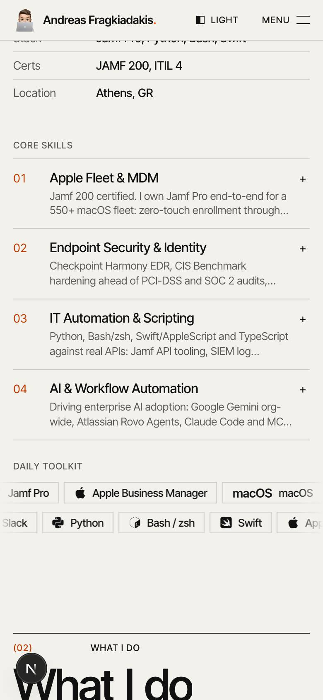 |  | 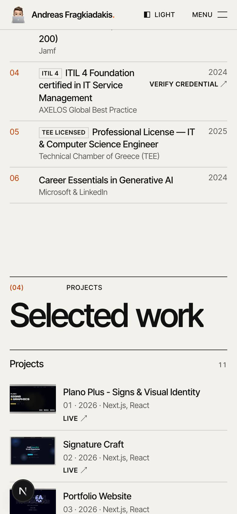 |  |

### Dark

| | |
| --- | --- |
|  |  |
|  |  |
|  |  |

| Mobile 1 | 2 | 3 | 4 | 5 |
| --- | --- | --- | --- | --- |
|  | 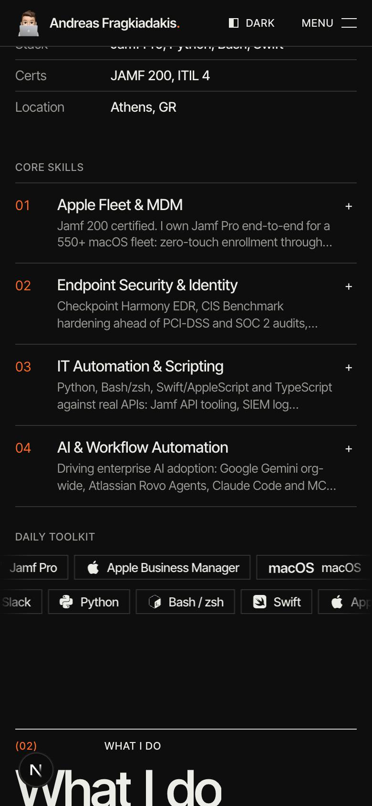 |  | 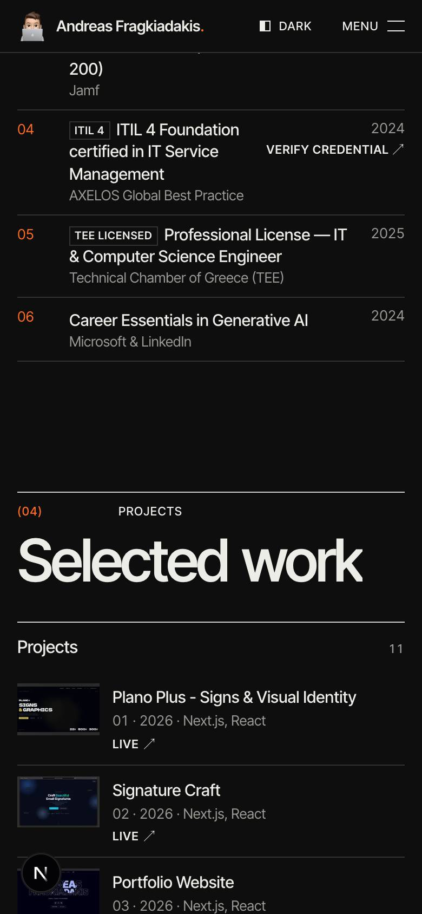 |  |

### States

| Projects row hover + preview | Career dialog (dark) |
| --- | --- |
| 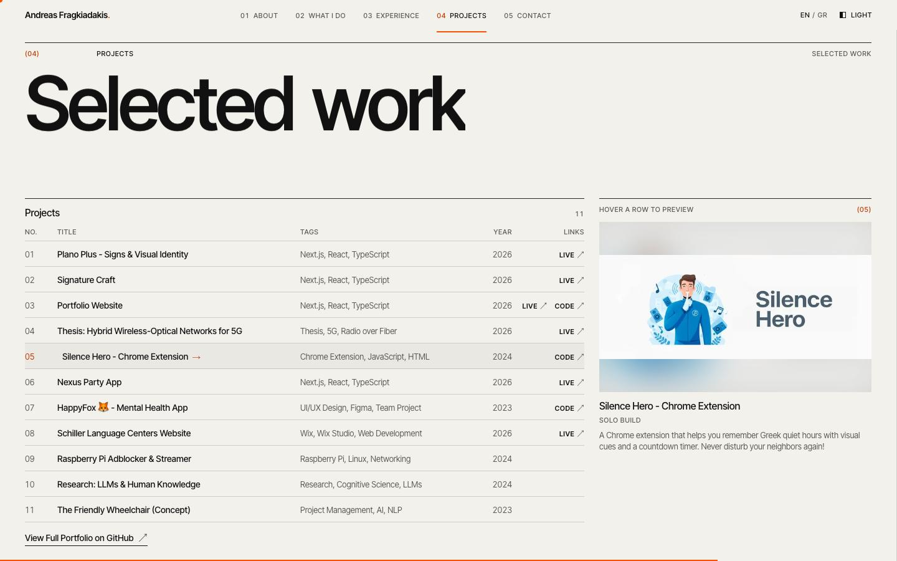 | 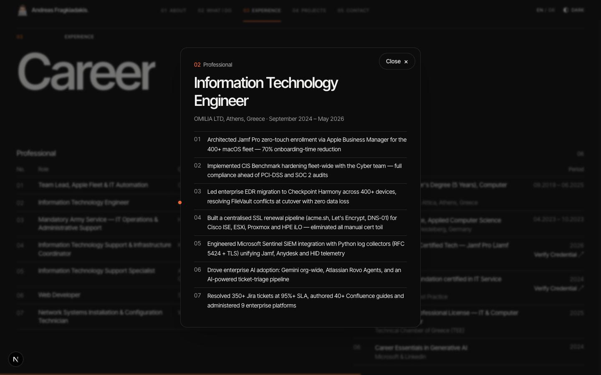 |
| **Greek hero (TikTok Sans Greek, fitted surname)** | **Keyboard focus** |
| 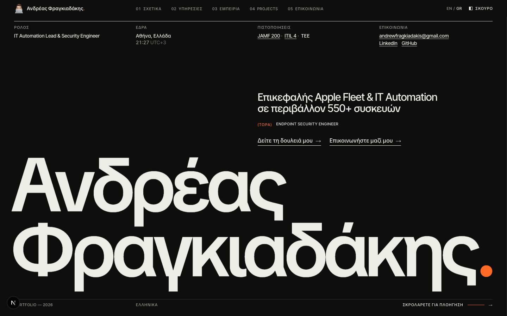 | 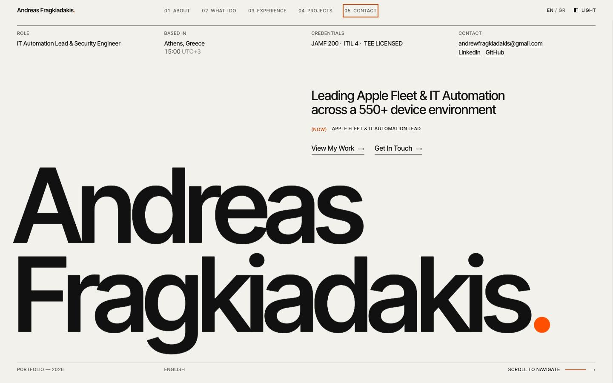 |
| **First-visit intro** | **OG image** |
| 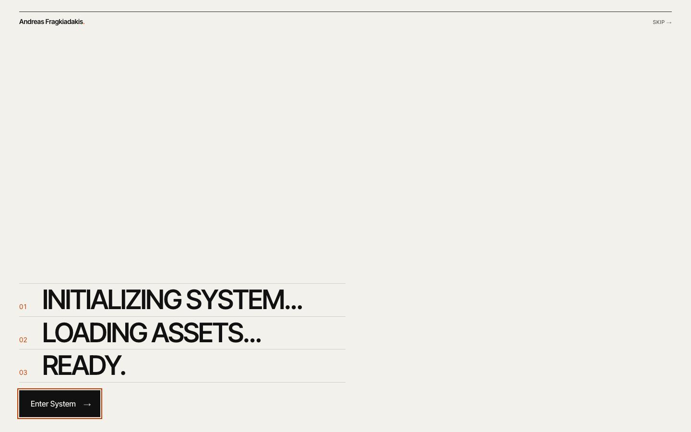 | 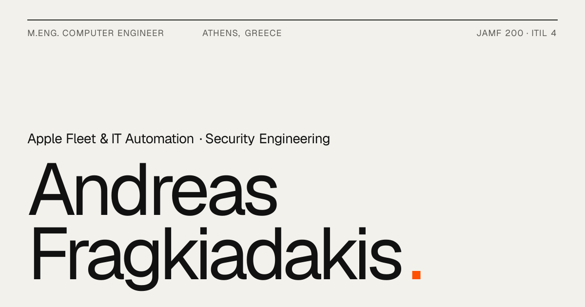 |

| Mobile menu | Greek mobile hero |
| --- | --- |
| 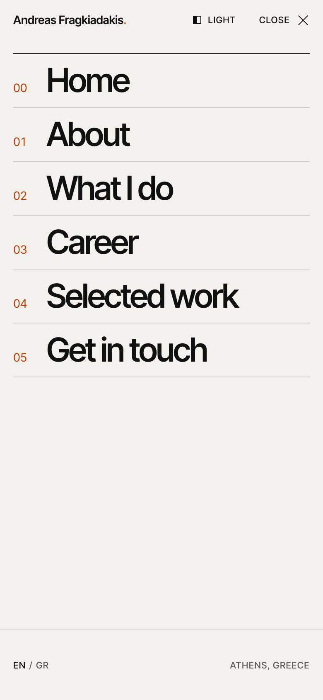 | 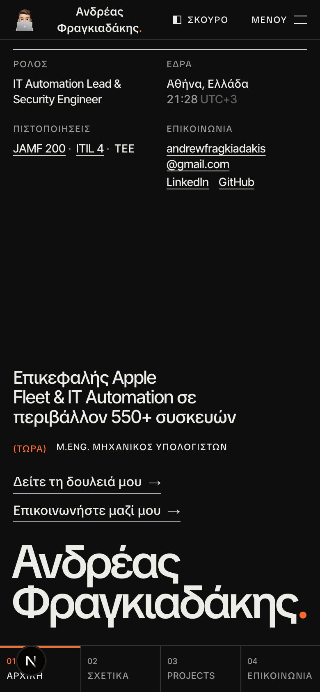 |

| Greek font finalists (Inter Tight Latin with each Greek candidate) |
| --- |
| 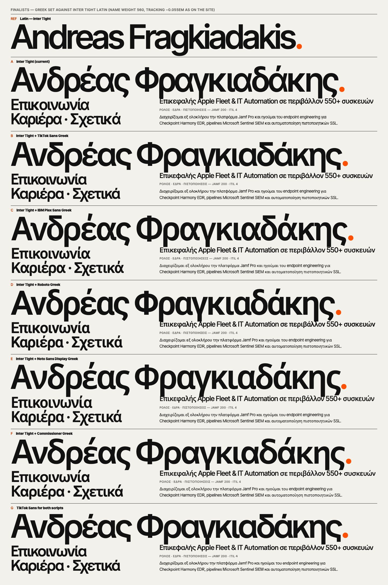 |
